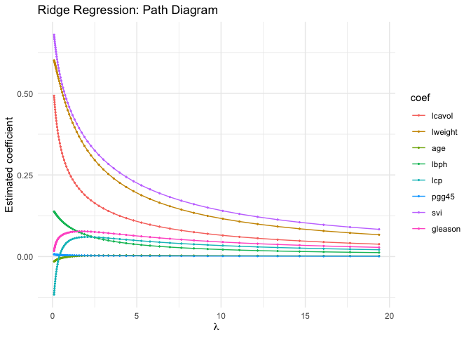
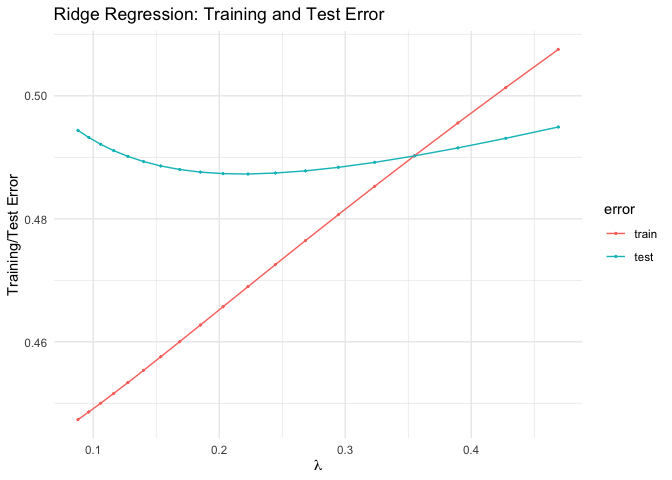

Use the prostate cancer data from the ElemStatLearn package for R.
------------------------------------------------------------------

    library(ElemStatLearn)
    library(tidyverse)
    library(glmnet)
    library(reshape)

    # import and show the data
    data(prostate)
    head(prostate)

    ##       lcavol  lweight age      lbph svi       lcp gleason pgg45       lpsa
    ## 1 -0.5798185 2.769459  50 -1.386294   0 -1.386294       6     0 -0.4307829
    ## 2 -0.9942523 3.319626  58 -1.386294   0 -1.386294       6     0 -0.1625189
    ## 3 -0.5108256 2.691243  74 -1.386294   0 -1.386294       7    20 -0.1625189
    ## 4 -1.2039728 3.282789  58 -1.386294   0 -1.386294       6     0 -0.1625189
    ## 5  0.7514161 3.432373  62 -1.386294   0 -1.386294       6     0  0.3715636
    ## 6 -1.0498221 3.228826  50 -1.386294   0 -1.386294       6     0  0.7654678
    ##   train
    ## 1  TRUE
    ## 2  TRUE
    ## 3  TRUE
    ## 4  TRUE
    ## 5  TRUE
    ## 6  TRUE

Use the cor function to reproduce the correlations listed in HTF Table 3.1, page 50.
------------------------------------------------------------------------------------

Table 3.1 reported the lower left side of the correlation matrix below:

    # get the training data and compute correlations
    prostate_train <- prostate %>% filter(train == TRUE) %>% select(-train)
    # correlation matrix
    round(cor(prostate_train), 3)

    ##         lcavol lweight   age   lbph    svi    lcp gleason  pgg45  lpsa
    ## lcavol   1.000   0.300 0.286  0.063  0.593  0.692   0.426  0.483 0.733
    ## lweight  0.300   1.000 0.317  0.437  0.181  0.157   0.024  0.074 0.485
    ## age      0.286   0.317 1.000  0.287  0.129  0.173   0.366  0.276 0.228
    ## lbph     0.063   0.437 0.287  1.000 -0.139 -0.089   0.033 -0.030 0.263
    ## svi      0.593   0.181 0.129 -0.139  1.000  0.671   0.307  0.481 0.557
    ## lcp      0.692   0.157 0.173 -0.089  0.671  1.000   0.476  0.663 0.489
    ## gleason  0.426   0.024 0.366  0.033  0.307  0.476   1.000  0.757 0.342
    ## pgg45    0.483   0.074 0.276 -0.030  0.481  0.663   0.757  1.000 0.448
    ## lpsa     0.733   0.485 0.228  0.263  0.557  0.489   0.342  0.448 1.000

Treat lpsa as the oucome, and use all other variables in the data set as predictors. With the training subset, train a least-squares regression model with all predictors using the lm function (with the training subset).
---------------------------------------------------------------------------------------------------------------------------------------------------------------------------------------------------------------------------

The results from the linear regression model with lpsa as outcome are
presented below:

    ls_train <- lm(lpsa ~ ., data = prostate_train)
    summary(ls_train)

    ## 
    ## Call:
    ## lm(formula = lpsa ~ ., data = prostate_train)
    ## 
    ## Residuals:
    ##      Min       1Q   Median       3Q      Max 
    ## -1.64870 -0.34147 -0.05424  0.44941  1.48675 
    ## 
    ## Coefficients:
    ##              Estimate Std. Error t value Pr(>|t|)    
    ## (Intercept)  0.429170   1.553588   0.276  0.78334    
    ## lcavol       0.576543   0.107438   5.366 1.47e-06 ***
    ## lweight      0.614020   0.223216   2.751  0.00792 ** 
    ## age         -0.019001   0.013612  -1.396  0.16806    
    ## lbph         0.144848   0.070457   2.056  0.04431 *  
    ## svi          0.737209   0.298555   2.469  0.01651 *  
    ## lcp         -0.206324   0.110516  -1.867  0.06697 .  
    ## gleason     -0.029503   0.201136  -0.147  0.88389    
    ## pgg45        0.009465   0.005447   1.738  0.08755 .  
    ## ---
    ## Signif. codes:  0 '***' 0.001 '**' 0.01 '*' 0.05 '.' 0.1 ' ' 1
    ## 
    ## Residual standard error: 0.7123 on 58 degrees of freedom
    ## Multiple R-squared:  0.6944, Adjusted R-squared:  0.6522 
    ## F-statistic: 16.47 on 8 and 58 DF,  p-value: 2.042e-12

Use the testing subset to compute the test error using the fitted least-squares regression model.
-------------------------------------------------------------------------------------------------

    # functions taken from the lecture notes (with changed outcome in error function):
    ## L2 loss for LM model only
    L2_loss <- function(y, yhat) {
      (y-yhat)^2
    }
    # compute both test and training error using L2 loss
    error <- function(dat, fit, loss=L2_loss){
      mean(loss(dat$lpsa, predict(fit, newdata=dat)))
    }
      
    # test dataset
    prostate_test <- prostate %>% filter(train == FALSE) %>% select(-train)
    ## testing error
    error(prostate_test, ls_train)

    ## [1] 0.521274

Using the *L*2 loss function, the test error is 0.521.

Train a ridge regression model using the glmnet function, and tune the value of lambda.
---------------------------------------------------------------------------------------

First, we fit ridge regression on the training data using ridge
regression in glmnet with the option nlambda = 100. This allows us to
fit ridge regression for 100 values of the tuning parameter lambda.

    # set the form for ridge regression
    form  <- lpsa ~ 0 + lcavol + lweight + age + lbph + lcp + pgg45 + svi + gleason
    x_inp <- model.matrix(form, data = prostate_train)
    y_out <- prostate_train$lpsa
    # try different lambdas
    ridge_train <- glmnet(x=x_inp, y=y_out, alpha = 0, nlambda = 100)

    # save the sequence of lambdas use to set ridge
    lambdas <- ridge_train$lambda

To tune the value of lambda, we pick the lambda (among those used in the
glmnet) that minimises the test error:

    ## functions to compute testing/training error with glmnet (using the l2 loss)
    error <- function(dat, fit, lam, form, loss = L2_loss) {
      x_inp <- model.matrix(form, data = dat)
      y_out <- dat$lpsa
      y_hat <- predict(fit, newx = x_inp, s = lam) 
      mean(loss(y_out, y_hat))
    }

    # compute test error for eache value of lambda used within ridge
    test_error <- sapply(lambdas, function(lam){error(prostate_test, ridge_train, lam, form)})
    # smallest test error
    min(test_error)

    ## [1] 0.4872819

The smallest test error is about 0.487 which is reached we lambda is:

    # pick the lambda that gives us the smallerst test error and print results
    lambda_sel <- lambdas[which.min(test_error)]
    lambda_sel

    ## [1] 0.2228282

The coefficients' estimate from ordinary least square and ridge
regression with lambda = 0.2228 are reported below. The table shows how
the coefficients estimated from ridge regression tend to be closer to
zero due to shrinkage.

    # print the results of the model with the smallest test error and compared it with the betas from lm
    best_fit <- glmnet(x = x_inp, y = y_out, alpha = 0, lambda = lambda_sel)
    df <- data.frame(RIDGE = as.vector(best_fit$beta), LS = coef(ls_train)[-1])
    round(df, 3)

    ##          RIDGE     LS
    ## lcavol   0.416  0.577
    ## lweight  0.573  0.614
    ## age     -0.010 -0.019
    ## lbph     0.128  0.145
    ## svi     -0.046  0.737
    ## lcp      0.006 -0.206
    ## gleason  0.619 -0.030
    ## pgg45    0.044  0.009

Create a path diagram of the ridge regression analysis
------------------------------------------------------

To create a path diagram we only considered the coefficients' estimate
associated with lambdas less than 20. While we could plot the path
diagram for each possible lambda used in glment, restricting the set of
tuning parameter helped us visualising each coefficient path:

    # get the path for each lambda
    ridge_path <- list()
    for(i in 1:nrow(ridge_train$beta)){
      ridge_path[[i]] <- data.frame(lambda = ridge_train$lambda, betas = ridge_train$beta[i, ], 
                                    coef = rownames(ridge_train$beta)[i])
    }
    paths <- do.call(rbind, ridge_path)
    paths <- paths[order(paths$lambda),]

    # too many lambda to plot graph is hard to see. Reduce range of lambda and plot
    paths %>% filter(lambda < 20) %>% ggplot(., aes(x = lambda, y = betas, col = coef)) + 
      geom_point(size = 0.4) + geom_line() + theme_minimal() + 
      labs(x = expression(lambda), y = "Estimated coefficient", title = "Ridge Regression: Path Diagram")

Create a figure that shows the training and test error associated with ridge regression as a function of lambda
---------------------------------------------------------------------------------------------------------------

We compute the test and training error for all possible values of lambda
used in glment, However, to create the plot we only considered values of
lambda &lt; 0.5 to ease visualisation:

    # compute traing error for each value of lambda used within ridge
    train_error <- sapply(lambdas, function(lam) {error(prostate_train, ridge_train, lam, form)})
    # test error was already computed

    # save in dataset and plot
    df.errors <- data.frame(lambda = lambdas, train = train_error, test = test_error)
    df.errorsLong <- melt(df.errors, id = "lambda")
    names(df.errorsLong) <- c("lambda", "error", "value")

    df.errorsLong %>% filter(lambda < 0.5) %>% 
      ggplot(., aes(x = lambda, y = value, col = error)) + geom_point(size = 0.4) + geom_line() + theme_minimal() + 
      labs(x = expression(lambda), y = "Training/Test Error", title = "Ridge Regression: Training and Test Error")

