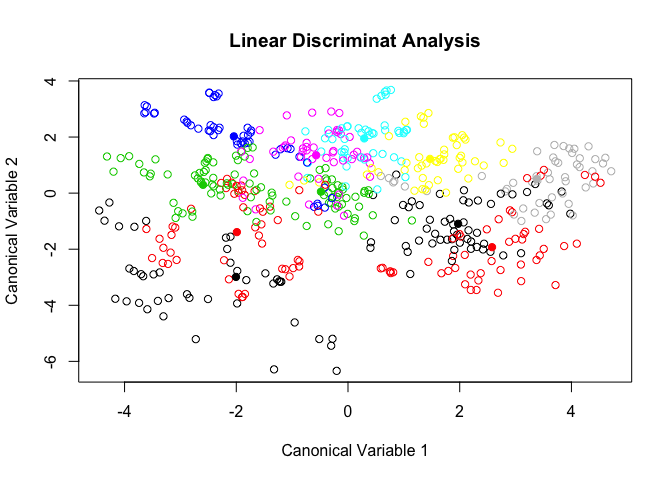
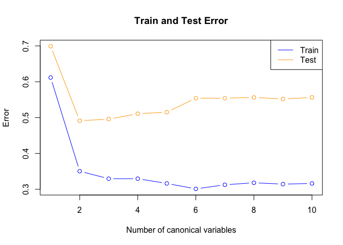

    library(ElemStatLearn)
    library(dplyr)
    library(mvtnorm)

### Retrieve the vowel data (training and testing) from the HTF website or R package.

    # get the data
    data(vowel.train)
    data(vowel.test)
    # save train and test with shorter names
    train <- vowel.train
    test <- vowel.test

### Implement reduced-rank LDA using the vowel training data.

The code to implement the reduced rank LDA was partially taken from the
R files on the class
[website](http://biostat.mc.vanderbilt.edu/wiki/Main/CourseBios362). To
implement reduced rank LDA we used the training dataset. The steps used
are below

-   center input globally

-   compute within-cluster means *M* and pooled within-cluster
    variance-covariance matrix *W*.

-   use singular value decomposition of *W* and compute sphered
    variables (using the centered inputs) and sphered centres (using the
    within-cluster mean).

-   from the sphered variables and centres compute the canonincal inputs
    and centers.

-   plot the first two canonical inputs.

<!-- -->

    # generate canonical variables for training set from reduced rank LDA (based on code provided in class)
    # get input matrix
    inpx <- as.matrix(train[, grep("x", names(train))])
    # center inputs globally
    inpx.centred <- scale(inpx, center = TRUE, scale = FALSE)

    ## compute within-cluster means M
    M <- t(sapply(unique(train$y), function(cls) 
      colMeans(inpx.centred[train$y==cls,])))
    ## compute pooled within-cluster var-cov W (Taken from Matt's code in mLR-delta.html)
    W <- Reduce(`+`, lapply(unique(train$y), function(cls) {
      x <- inpx[train$y == cls,]
      x <- t(t(x)-colMeans(x))
      t(x)%*%x}))/(nrow(train)-11)

    ## compute sphere variables and center xVD^{-1/2} where V and D are taken from svd of var and cov matrix Sigma
    svdx <- svd(W)
    sphx <- inpx.centred%*%svdx$v%*%diag(sqrt(1/svdx$d))
    sphc <- M%*%svdx$v%*%diag(sqrt(1/svdx$d))
      
    ## compute canonical inputs and centers
    svdc <- svd(sphc)
    xl <- sphx%*%svdc$v
    colnames(xl) <- paste0("c", 1:10)
    mul <- sphc%*%svdc$v
    colnames(mul) <- paste0("m", 1:10)
      
    # Plot 4.4
    plot(xl[, "c1"], xl[, "c2"], 
         col = train$y, main = "Linear Discriminat Analysis", xlab = "Canonical Variable 1",
         ylab = "Canonical Variable 2")
    # add means
    points(mul[, "m1"], mul[, "m2"], col = train$y, pch = 19)

### Use the vowel testing data to estimate the expected prediciton error (assuming zero-one loss), varying the number of canonical variables used for classification.

The zero-one loss gives us the misclassification error. First, we look
at the misclassification error in the training sample by number of
canonical variables used:

    # first start with training error
    c.train <- xl
    m.train <- mul
    # classification: each column represent a case depending on the number of canonical variables used
    classify.train <- matrix(NA, nrow=nrow(train), ncol=10)  
    delta <- c()
    # for each x observed
    for( x in 1:nrow(train)){
      # used 1 to 10 canonical variables
      for( cn in 1:10){ 
        # for each class k compute the delta
        for( ml in 1:11){
          delta[ml] <- log(1/11) - 0.5*sum((c.train[x, 1:cn] - m.train[ml, 1:cn])^2)
        }
        # classify x to the maximum delta
        classify.train[x, cn] <- which.max(delta)
      }
    } 
    # plot error
    train.error <- c()
    for(i in 1:10){
      train.error[i] <- mean(classify.train[, i] != train$y)
    }

    rbind(1:10, train.error)

    ##                  [,1]      [,2]      [,3]      [,4]      [,5]      [,6]   [,7]
    ##             1.0000000 2.0000000 3.0000000 4.0000000 5.0000000 6.0000000 7.0000
    ## train.error 0.6117424 0.3503788 0.3295455 0.3295455 0.3162879 0.3011364 0.3125
    ##                  [,8]      [,9]      [,10]
    ##             8.0000000 9.0000000 10.0000000
    ## train.error 0.3181818 0.3143939  0.3162879

Then, we look at the misclassification error in the test sample by
number of canonical variables used. For the test sample we need to
center the inputs based on the overall means computed in the training
sample.

    # then do test error (cannot use the same function to campute canonical inputs)
    # transform the new inputs into canonical variable space
    inpx.test <- as.matrix(test[, grep("x", names(test))])
    inpx.centred.test <- t(t(inpx.test) - attr(inpx.centred, 'scaled:center')) 
    # sphered
    s.test <- inpx.centred.test %*% svdx$v %*% diag(1/sqrt(svdx$d))
    c.test <- s.test %*% svdc$v

    # test error
    # classification
    classify.test <- matrix(NA, nrow=nrow(test), ncol=10) # number of samples x number of projection dimensions 
    delta <- c()
    for( x in 1:nrow(test)){ # for each new obs
      for( cn in 1:10){ # for each projection dimension 
        for( ml in 1:11){ # for each class centroid
          delta[ml] <- log(1/11) - 0.5*sum((c.test[x, 1:cn] - m.train[ml, 1:cn])^2)
        }
        classify.test[x, cn] = which.max(delta)
      }
    } 
    # plot error
    test.error <- c()
    for(i in 1:10){
      test.error[i] <- mean(classify.test[, i] != test$y)
    }

    rbind(1:10, test.error)

    ##                 [,1]     [,2]     [,3]      [,4]      [,5]      [,6]      [,7]
    ##            1.0000000 2.000000 3.000000 4.0000000 5.0000000 6.0000000 7.0000000
    ## test.error 0.6991342 0.491342 0.495671 0.5108225 0.5151515 0.5541126 0.5541126
    ##                 [,8]      [,9]      [,10]
    ##            8.0000000 9.0000000 10.0000000
    ## test.error 0.5562771 0.5519481  0.5562771

### Plot the EPE as a function of the number of discriminant variables, and compare this with HTF Figure 4.10.

The plot below reproduces figure 4.10 in the book.

    # plot train and test error together
    plot(1:10, train.error, type = "b", col = "blue", ylim = c(0.3, 0.7), ylab = "Error",
         xlab = "Number of canonical variables", main = "Train and Test Error")
    lines(1:10, test.error, type = "b", col = "orange")
    legend("topright", legend=c("Train", "Test"), col = c("blue", "orange"), lty = 1)

